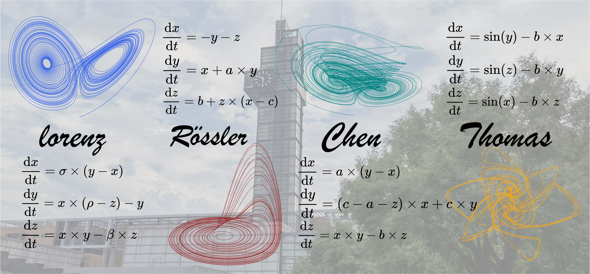

I am a senior student in [Xidian University](https://www.xidian.edu.cn/), with school of Artifical Intelligence.

My research instrests include Time Series Analysis (TSA), Signal Processing, Complex System Modeling, Learning to Optimize (L2O).

I'm captivated by **time series** in all forms, whicn intricate dances of data that unveil the hidden rhythms of complex dynamical systems. Each time series whisper the story of its creator: perhaps a high-order linear systems, a nonlinear systems, or a chaotic. When you trace their essence through differential equations, you cannot escape the haunting beauty of chaos and fractals, a universe where order and turbulence waltz in eternal paradox.

Publications
======
  <ul>
    
  </ul>