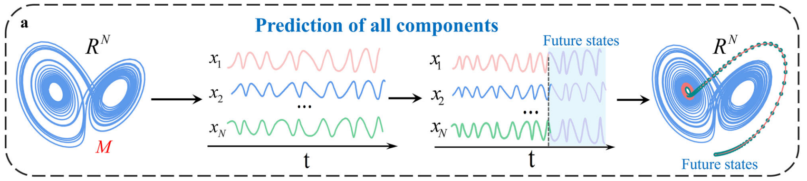

This article reduces the dimensionality of high-dimensional complex systems through manifold learning and delayed embedding methods, and realizes the modeling and prediction of the complex system in low-dimensional space. 

## Abstract

> Received: 11 November 2023
>
> Accepted: 4 March 2024

Forecasting all components in complex systems is an open and challenging task, possibly due to high dimensionality and undesirable predictors. 
We bridge this gap by proposing a data-driven and model-free framework, namely, feature-and-reconstructed manifold mapping (FRMM), 
which is a combination of feature embedding and delay embedding. 
For a high-dimensional dynamical system, FRMM finds its topologically equivalent manifolds with low dimensions from feature embedding and delay embedding and then sets the low-dimensional feature manifold as a generalized predictor to achieve predictions of all components. 
The substantial potential of FRMM is shown for both representative models and real-world data involving Indian monsoon, electroencephalogram (EEG) signals, foreign exchange market, and traffic speed in Los Angeles Country. 
FRMM overcomes the curse of dimensionality and finds a generalized predictor, and thus has potential for applications in many other real-world systems.

> 核心观点：高维复杂系统中通常包含大量的冗余信息，其基本动力学规则或结构可以通过低维系统来表征。
