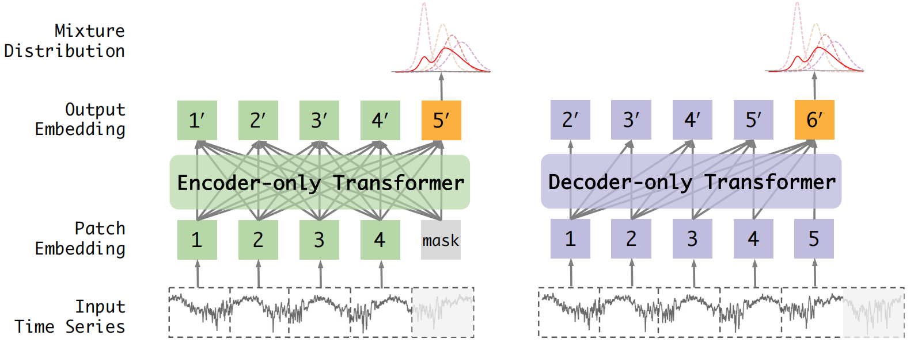
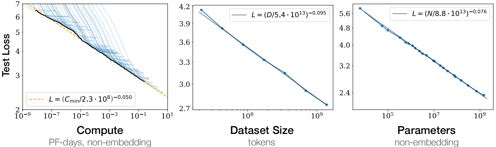
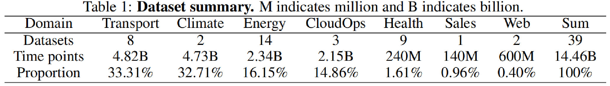
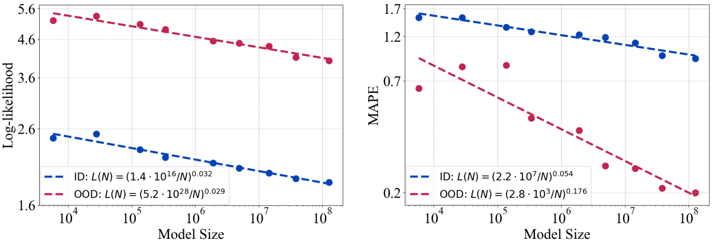
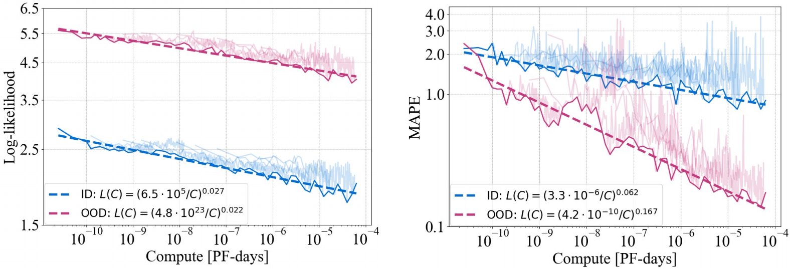
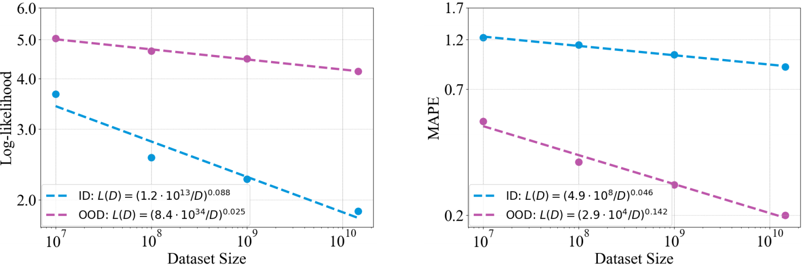
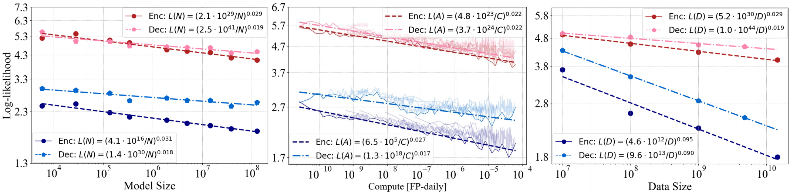
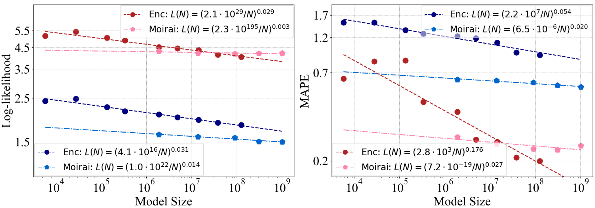
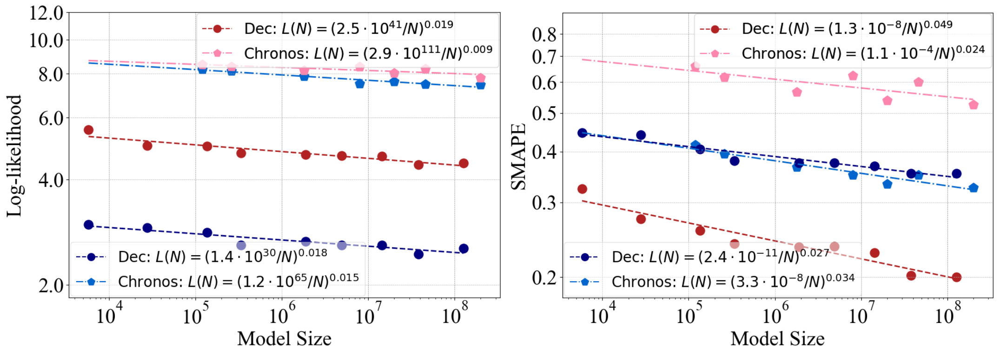

This paper explores the scaling laws of time series foundations and verifies the prediction performance of two mainstream Transformer architectures, Encoder-only and Decoder-only, on in-distribution and out-of-distribution data on a large-scale time series dataset.  

## Abstract

Scaling laws offer valuable insights into the design of time series foundation models (TSFMs). However, previous research has largely focused on the scaling laws of TSFMs for in-distribution (ID) data, leaving their out-of-distribution (OOD) scaling behavior and the influence of model architectures less explored. In this work, we examine two common TSFM architectures—encoder-only and decoder-only Transformers—and investigate their scaling behavior on both ID and OOD data. These models are trained and evaluated across varying parameter counts, compute budgets, and dataset sizes. Our experiments reveal that the log-likelihood loss of TSFMs exhibits similar scaling behavior in both OOD and ID settings. We further compare the scaling properties across different architectures, incorporating two state-of-the-art TSFMs as case studies, showing that model architecture plays a significant role in scaling. The encoder-only Transformers demonstrate better scalability than the decoder-only Transformers, while the architectural enhancements in the two advanced TSFMs primarily improve ID performance but reduce OOD scalability. While scaling up TSFMs is expected to drive performance breakthroughs, the lack of a comprehensive understanding of TSFM scaling laws has hindered the development of a robust framework to guide model scaling. We fill this gap in this work by synthesizing our findings and providing practical guidelines for designing and scaling larger TSFMs with enhanced model capabilities.

> 对实验过程不感兴趣的朋友可以直接看最后的总体结论，希望能对大家构造基础模型提供一定的启发🥰。

## The Scaling Laws of Neural Networks

缩放定律的核心内容：对于基于transformer的语言模型，假设模型的参数量为N，数据集tokens个数为D，那么，模型的计算量可以大致估计为C= 6N*D 。模型的计算量C一定后，模型的性能即精度就基本确定。它的决策变量只有N和D，跟模型的具体结构诸如层数、 深度、 attention头个数（宽度）基本无关。相关性非常小，性能（即test loss）在2%的区间内。

**缩放定律可以理解为探究模型效果与①模型参数；②数据集大小；③计算资源的关系。**

**可以为某个领域基础模型的构建提供一定的方向和指导。**

### 研究动机

- 动机一：目前时间序列分析领域中的基础模型还处于初级阶段，即模型构建阶段，在这个阶段中探究缩放定律将能够更好的指导基础模型的构建，为时序预训练模型提供一个指导方针。
- 动机二：以往的研究主要集中在分布内（ID）数据的TSFMs的缩放规律上，而忽略了它们的分布外（OOD）缩放行为和模型架构的影响。

## 解决的主要问题

### do scaling laws apply to predict ood forecasting performance?

由于时间序列具有高度的随机性，因此预测任务的训练集和测试集可能具有较大的差异，因此预测任务可以看作是一种数据分布外预测。那么就需要验证在时间序列分析中，缩放定律是否也对分布之外的预测任务有关。

### how do model architectures affect scalability?

时间序列基础模型已经有了多种不同的架构比如encoder-only和decoder-only,那么这些不同的模型架构对模型的可拓展性有什么影响吗？到底是哪一种架构更适合来处理时间序列数据？这种结构起作用的原因又是什么？这三个问题非常值得探索。

### how to design TSFMs from the perspective of scalability?

一个很明显的趋势是：时间序列基础模型的规模正在变得越来越大，那么越大的模型效果就一定越好吗？模型的大小目前有什么性能瓶颈吗？我们在设计模型时又应该如何平衡模型的大小和计算资源来取得更好的效果。

> 简要结果：本文训练了一组基于Transformer的两种架构的tsfm，通过控制变量的方式改变三个基本的训练因素：**模型大小**、**计算预算**和**训练集大小**。实验结果表明仅编码器变压器比仅解码器变压器具有更好的可扩展性。
>
> 本研究使用的模型框架和数据集规模如下所示：

## Scaling law 实验方法

首先构建了一个大规模的数据集来进行预训练，随后在其上验证了编码器和解码器模型以及两种SOTA框架在分布内和分布外时的性能表现。本文讲数据集划分为三个子集，均匀地取95%的数据作为训练集，其余数据作为in-distribution数据进行验证，使用其余的基准数据集作为out-of-distribution来验证。

这里选取的SOTA模型为：

1. Moriai：encoder-only
2. Chornos：decoder-only

这篇文章的整体工作蓝很大探究了$$10^3$$到$$10^8$$量级的模型效果，使用的优化器是AdamW，模型训练的batch size为128，使用的动态学习率调整方式为cosine learning rate adjust，最后模型学习和输出的是一个混合分布。

## 对Encoder-Only缩放定理研究

### 实验①：探究模型学习效果与模型大小的关系

**实验结果：**①对数似然函数在分布内和分布外中具有相同的变化率但是截距不同，说明模型具有一定的性能偏差。②增大模型性能对分布外会产生更大的影响，对于分布外泛化能力较弱的模型，增加模型大小可以使它们在分布内和分布外数据上表现得同样好。

### 实验②：探究模型学习效果与计算量的关系

**实验结果：**①在训练中通过调整模型参数N，固定批量B和更新次数S来获得算力大小。②观测指标带有较强的噪声，文章说是由优化器和动态学习率调整导致的。③其余结论和上述实验结果相似。

### 实验③：探究模型学习效果与训练数据大小的关系

**实验结果：**①增大数据集大小对模型性能在分布内和分布外数据上产生了不同的缩放影响。②分布内数据的性能对数据集大小的拓展更为敏感，MAPE这个指标都是分布外比分布内更加敏感。

> **三个实验获得的主要结论：**
>
> 1. 在分布内和分布外的单变量时间序列预测中，模型的性能都遵循作为模型参数的函数、数据量和计算的简单幂律。
> 2. 对于对数似然损失，在模型大小或计算资源方面，该模型在分布内和分布外场景中都显示出相似的缩放模式。
> 3. 当使用MAPE作为度量时，与分布内性能相比，所有三个因素的缩放会使分布外性能得到更大的改进。

## 探究不同模型架构的影响

上面的三个实验仅验证了Encoder-only架构，下面将验证包括Decoder-only和两种SOTA模型架构。

### 实验④：探究Encoder-only和Decoder-only的缩放定律

**实验结论：**①在分布内和分布外设置下，仅编码器Transformer的幂律指数始终高于仅解码器Transformer，表明其在参数上具有优越的可伸缩性，仅使用编码器的Transformer通常可以获得较低的对数似然损失，这意味着更好的预测性能。②仅编码器和解码器Transformer的比例律拟合线在数据大小尺度上表现出几乎恒定的偏移量和相似的斜率。这表明，尽管在性能上存在差异，但仅编码器和仅解码器的变压器的缩放行为高度相似。

### 实验⑤：对比了Encoder-only架构和Moriai(多变量注意力机制和任意长度的Patch)

**实验结论：**在分布内数据上，Moirai表现出了更好的性能。然而，对于分布外数据，随着模型参数数量的增加，Moirai逐渐被仅使用编码器的Transformer所超越。在改进模型架构提高下游任务效果的同时，却削弱了模型的泛化能力。

> **注意：**使用原生态的Transformer架构确实有一定的好处，比如Llama3系列的成功确实证明了最原始Transformer架构不经过改进也能取得很好的性能。
>
> **这里的实验结论意味着：**①绝大多数应用场景下，由于训练的数据量通常不大，在此条件下我们对模型架构进行针对性的改进往往能够提高模型的泛化能力；②但是随着数据量的不断增强，由于我们对模型的改进往往都是特定的或是有针对性的，因此这种改进反而会限制模型的泛化能力。

### 实验⑥：对比了Dncoder-only架构和Chronos(seq2seq模型)

**实验结论：**①Chronos在分布内数据的性能和可伸缩性方面有轻微的优势。②然而，在分布外数据上，仅解码器Transformer的性能要好得多。③总体而言，Chronos的设计改进增强了分布内时间序列预测，但并没有有效地提高在分布外数据上的泛化能力。

## Scaling law 为我们设计基础模型带来的启发

> **全文回顾：**本文探究了时间序列基础的缩放定律，验证了Encoder-only和Decoder-only两个架构在训练数据，模型规模和架构，以及计算资源对最终性能的影响。

### Training Data

扩大预训练数据集的规模能够有效并且同时提高在分布内和分布外数据上的性能表现。

所以一个大的并且表征全面的预训练数据集对于构建基础模型来说至关重要。、

并且，增加数据集大小带来的性能提升是独立于模型架构和训练方法的。

### Model Parameters and Architecture

模型的大小是提高性能的最关键因素，不论是分布内还是分布外提高模型的大小带来的性能提升是最为直接的。

在时间序列预训练模型中编码器架构的泛化能力和可拓展性要强于解码器模型。

对模型性能的针对性改进往往会有效提高在分布内数据上的性能，但会降低其在分布外数据上的泛化性能。

### Computational Budget

在给定的计算预算下，模型的性能存在一个牢不可破的下界。

这意味着，由于其他因素保持不变，随着模型规模的增加，必须投入更多的计算资源，以获得更好的性能。

然而，不同的训练目标（损失函数）或模型架构可能会显著影响这个下界。