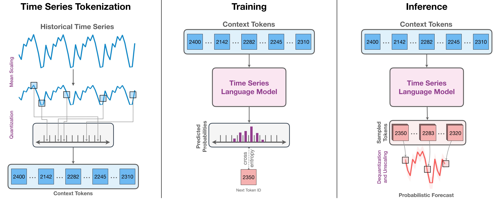

Chronos tokenizes time series values using scaling and quantization into a fixed vocabulary and trains existing transformer-based language model architectures on these tokenized time series via the cross-entropy loss. 

## Abstract

We introduce Chronos, a simple yet effective framework for **pretrained probabilistic time series models**. Chronos <u>tokenizes time series values</u> using scaling and quantization into a **fixed vocabulary** and trains existing transformer-based language model architectures on these tokenized time series via the **cross-entropy loss**. We pretrained Chronos models based on the **T5 family** (ranging from 20M to 710M parameters) on <u>a large collection of publicly available datasets</u>, complemented by a <u>synthetic dataset</u> that we generated via Gaussian processes to improve generalization. In a comprehensive benchmark consisting of 42 datasets, and comprising both classical local models and deep learning methods, we show that Chronos models: (a) significantly outperform other methods on datasets that were part of the training corpus; and (b) have comparable and occasionally **superior zero-shot performance** on new datasets, relative to methods that were trained specifically on them. Our results demonstrate that Chronos models can leverage time series data from diverse domains to improve zero-shot accuracy on unseen forecasting tasks, positioning pretrained models as a viable tool to greatly simplify forecasting pipelines.

> 引子：在自然语言处理领域，大语言模型通过在大量的文本数据集上仅需了预训练，从而获得了zero-shot的文本处理能力。那么同样为序列数据，时间序列中的基础模型能否像自然语言处理中的大语言模型一样具有零样本预测能力呢？
>
> 带着这个疑问，我们开启本篇文章的介绍🥰

## Introduction

时间序列基础模型和大语言模型同样是处理序列数据，那究竟有哪些不同呢？

**我的回答是Token的形式：**自然语言数据的Token是有限的且离散的，而时间序列的数值是无限的且连续的。这导致我们无法像编码词向量那样来编码一段时间序列。而Chornos这篇文章的重点问题是：我们能否像大语言模型学习自然语言数据那样，让时间序列基础模型来学习时间序列的基本表征？

> **换句话说：**预测下一个Token的大语言模型和预测下一个数值的时间序列基础模型都有哪些不同呢？这两项努力的根本目标都是对数据的顺序结构进行建模，以预测未来的模式。
>
> **答案十分明显：**时间序列的本质是一串随机波动的数值，而我们无法像编码一个词一样在一个有限空间中编码出所有的随机数值来。

综上，Chronos要做的第一件事就是如何用一个有限的空间编码出无限范围的数值。Chronos使用了最小的修改方式，让原本的语言模型能够学习时间序列数据的表征。下面我们简要的分析总结一下这篇文章的内容：

1. Chronos通过简单的**缩放**和**量化实值**，将时间序列标记为离散的Token，这样做可以不改变大语言模型的结构，直接使用语言的模型来学习时间序列的基本表征。
2. 通过上述的编码方式，每一个Token将对应一段特定的数值范围，因此在训练模型的输出时我们可以使用线性分类头和交叉熵损失函数，其训练的本质是让模型在正确的位置上输出正确的Token（可以理解为分类），最后的预测是概率预测。
3. 为了更好的训练一个基础模型，Chronos在一个大规模的数据集上进行了训练，并且使用了TSMixup这种数据增强方式和依赖于高斯过程的数据合成方式来提高数据集的质量。

## Content

下面我将简单介绍Chronos的时间序列编码方式、训练方式以及数据增强技术。

### Time Series Tokenization

**Scaling：**由于直接编码过大的数值空间是否具有难度，比如正无穷到负无穷，因此要做的第一件事就是对时间序列数据进行缩放，其实也就是所谓的标准化或归一化。我们将一段时间序列从原本的值域中缩放到一个合适的量化范围中，本文使用的方法为

$$
\tilde{x}_i = \frac{(x_i - m)}{s}, \ m=0, \ s=\frac{1}{C}\sum_{i=1}^{C}|x_i|
$$

**Quantization：**在合适的范围内，Chronos对特定的一片数值范围进行编码，如果这段数据范围能够确定到小数点后几位，那么通过近似的方法，我们就认为该方式成功对实值时间序列数据进行了编码。通过这种方式，我们能将每一个时间点看作是一个特殊的Token来使用。

### Objective Function

Chronos的训练和绝大多多数的大语言模型的训练方法一致，都是根据输入的Token序列，通过最后一层的线性头来概率建模下一个最可能的Token（单词）是谁。这种训练方式本质上可以看作是一种分类任务。

比如“中国的首都是…”，当输入到“是”这个词后的那个位置，大语言模型将会判断这个位置上最可能的词，也就是分类概率最大的一个词是“北”，而下一个最可能位于该位置的词是“京”。

由于我们将预测看作是Next-token prediction任务，因此在下一个时间戳位置上进行预测时，将会根据历史的输入（前几个Token）确定当前时刻最有可能的那个Token（Softmax概率预测），具体的预测任务可以写为$$p(z_{C+h+1}|z_{1:C+h})$$，其中$$z_{C+h+1}$$表示要预测的下一个Token，$$z_{1:C+h}$$表示历史的输入信息。因此该训练方式需要使用交叉熵损失函数：

$$
\mathcal{L}_{\theta} = - \sum_{h=1}^{H+1}\sum_{i=1}^{\mathcal V_{ts}}\mathbf{1}_(z_{C+h+1} = i) \mathrm{log} p_{\theta}(z_{C+h+1}|z_{1:C+h})
$$

### Data Augmentation

除真实数据外，为了进一步补充训练数据集，Chronos提出了一种基于**KernelSynth**的方法，利用高斯过程（GPs）生成合成时间序列的方法。主要的流程是使用随机高斯过程生成大量的随机核，然后通过这些核作为滤波器进行采样获得大量的时间序列数据。

