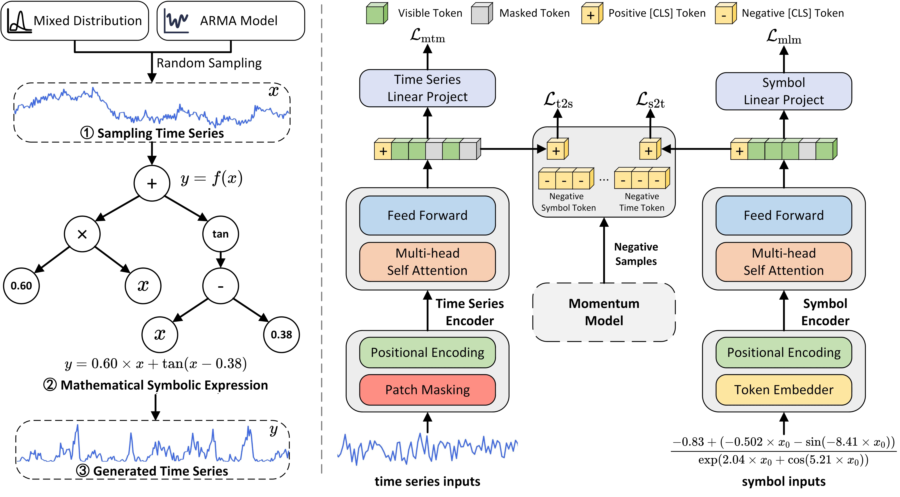
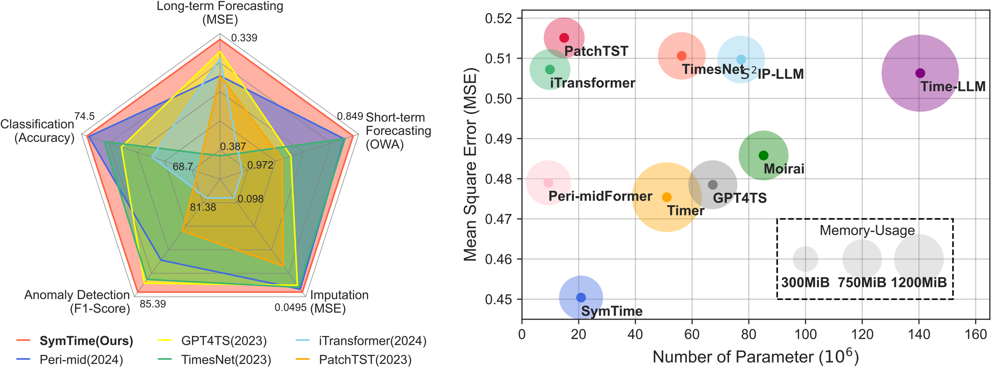

## Abstract

**Foundation models** for <u>time series analysis (TSA)</u> have attracted significant attention. However, challenges such as `data scarcity and data imbalance` continue to hinder their development. To address this, we consider **modeling complex systems** through symbolic expressions that serve as **semantic descriptors** of time series. Building on this concept, we introduce a **series-symbol (S2) dual-modulity data generation mechanism**, enabling the <u>unrestricted creation</u> of high-quality time series data paired with corresponding symbolic representations. Leveraging the S2 dataset, we develop `SymTime`, a pre-trained foundation model for TSA. SymTime demonstrates competitive performance across **five major TSA tasks** when fine-tuned with downstream task, rivaling foundation models pre-trained on real-world datasets. This approach underscores the potential of dual-modality data generation and pretraining mechanisms in overcoming data scarcity and enhancing task performance.

## Main Idea

To address the issue of data distribution imbalance and explore the semantic information of time series, this paper starting from the nature and mechanisms of time series, posits that time series are representations of complex dynamical systems. 

- On one hand, the intricate patterns within natural systems can be captured through observed numerical data; for instance, the time series of body temperature fluctuations throughout a day is derived from observations of the human system. 

- On the other hand, complex systems can be expressed abstractly using mathematical symbols and formulas, with ordinary differential equations (ODE) and partial differential equations (PDE) being the most common methods for modeling complex systems. Symbols provide semantic information for modeling complex systems.

## Our Work

We propose an unrestricted dual-modality time series-symbolic expression data generation mechanism, through which we have constructed a large-scale synthetic dataset and trained a dual-encoder time series foundation model.

During training, we employ masked modeling to enable the time series encoder and symbolic expression encoder to learn fundamental representations by reconstructing masked segments. To capture cross-modal features between time series and symbolic expressions, we implement MoCo methodology using momentum models and [CLS] tokens to establish a feature-consistent large-scale dictionary, introducing bidirectional contrastive losses (time series-to-symbolic expression and symbolic expression-to-time series). This framework enables pretraining of a time series encoder that simultaneously acquires temporal representation capabilities and symbolic semantic awareness.

## Main Results

The time series foundation model `SymTime` trained with the aforementioned method not only achieves **state-of-the-art (SOTA)** performance in long-term forecasting, short-term forecasting, classification, imputation, and anomaly detection tasks, but also maintains low computational complexity.

## Interesting Phenomenon

By leveraging contrastive learning that brings positive samples closer while pushing negative samples apart in the **representation space**, our time series encoder effectively captures <u>semantic information</u> from symbolic expressions through cross-modal alignment. As shown in the figure, when feeding time series generated from different symbolic expressions into the untrained encoder, t-SNE visualization reveals disordered distribution. After contrastive pretraining, however, the trained encoder organizes time series of identical symbolic categories into distinct cluster formations through the same procedure. This conclusively demonstrates our encoder's capability to learn symbolic semantics.
