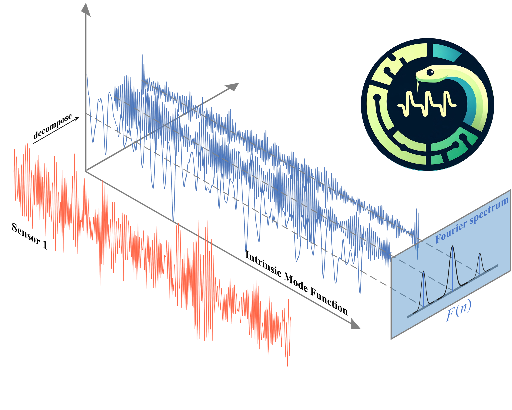
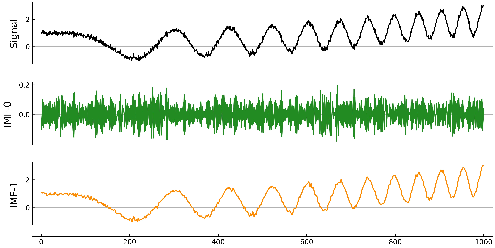
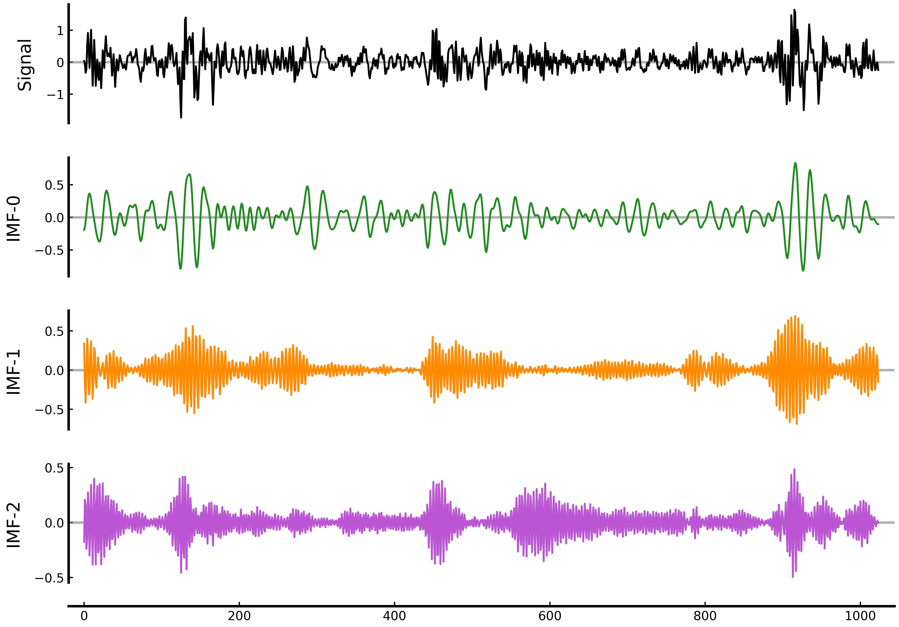
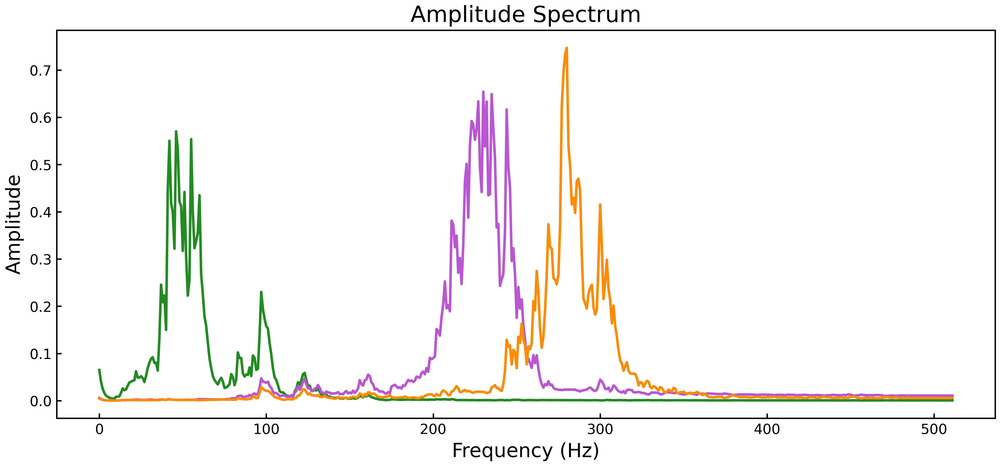

A Python library for signal decomposition algorithms 🥳

[Github Page](https://github.com/wwhenxuan/PySDKit) |
[Installation](#Installation) |
[Example Script](#Example-Script) |
[Acknowledgements](#Acknowledgements)

## Installation 🚀 

You can install `PySDKit` through pip:

~~~
pip install pysdkit
~~~

We only used [`NumPy`](https://numpy.org/), [`Scipy`](https://scipy.org/) and [`matplotlib`](https://matplotlib.org/) when developing the project.

## Example Script ✨ 

This project integrates simple signal processing methods, signal decomposition and visualization, and builds a general interface similar to [`Scikit-learn`](https://scikit-learn.org/stable/). It is mainly divided into three steps:
1. Import the signal decomposition method;
2. Create an instance for signal decomposition;
3. Use the `fit_transform` method to implement signal decomposition;
4. Visualize and analyze the original signal and the intrinsic mode functions IMFs obtained by decomposition.

~~~python
from pysdkit import EMD
from pysdkit.data import test_emd
from pysdkit.plot import plot_IMFs

t, signal = test_emd()

# create an instance for signal decomposition
emd = EMD()
# implement signal decomposition
IMFs = emd.fit_transform(signal, max_imfs=2)
plot_IMFs(signal, IMFs)
~~~

The EMD in the above example is the most classic [`empirical mode decomposition`](https://www.mathworks.com/help/signal/ref/emd.html) algorithm in signal decomposition. For more complex signals, you can try other algorithms such as variational mode decomposition ([`VMD`](https://ieeexplore.ieee.org/abstract/document/6655981)).

~~~python
import numpy as np
from pysdkit import VMD

# load new signal
signal = np.load("./example/example.npy")

# use variational mode decomposition
vmd = VMD(alpha=500, K=3, tau=0.0, tol=1e-9)
IMFs = vmd.fit_transform(signal=signal)
print(IMFs.shape)

vmd.plot_IMFs(save_figure=True)
~~~

Better observe the characteristics of the decomposed intrinsic mode function in the frequency domain.

~~~python
from pysdkit.plot import plot_IMFs_amplitude_spectra

# frequency domain visualization
plot_IMFs_amplitude_spectra(IMFs, smooth="exp")   # use exp smooth
~~~

## Acknowledgements 🎖️ 

We would like to thank the researchers in signal processing for providing us with valuable algorithms and promoting the continuous progress in this field. However, since the main programming language used in `signal processing` is `Matlab`, and `Python` is the main battlefield of `machine learning` and `deep learning`, the usage of signal decomposition in machine learning and deep learning is far less extensive than `wavelet transformation`. In order to further promote the organic combination of signal decomposition and machine learning, we developed `PySDKit`. We would like to express our gratitude to [PyEMD](https://github.com/laszukdawid/PyEMD), [Sktime](https://www.sktime.net/en/latest/index.html), [Scikit-learn](https://scikit-learn.org/stable/), [Scikit-Image](https://scikit-image.org/docs/stable/), [statsmodels](https://www.statsmodels.org/stable/index.html), [vmdpy](https://github.com/vrcarva/vmdpy),  [MEMD-Python-](https://github.com/mariogrune/MEMD-Python-),  [ewtpy](https://github.com/vrcarva/ewtpy), [EWT-Python](https://github.com/bhurat/EWT-Python), [PyLMD](https://github.com/shownlin/PyLMD), [pywt](https://github.com/PyWavelets/pywt), [SP_Lib](https://github.com/hustcxl/SP_Lib)and [dsatools](https://github.com/MVRonkin/dsatools).
